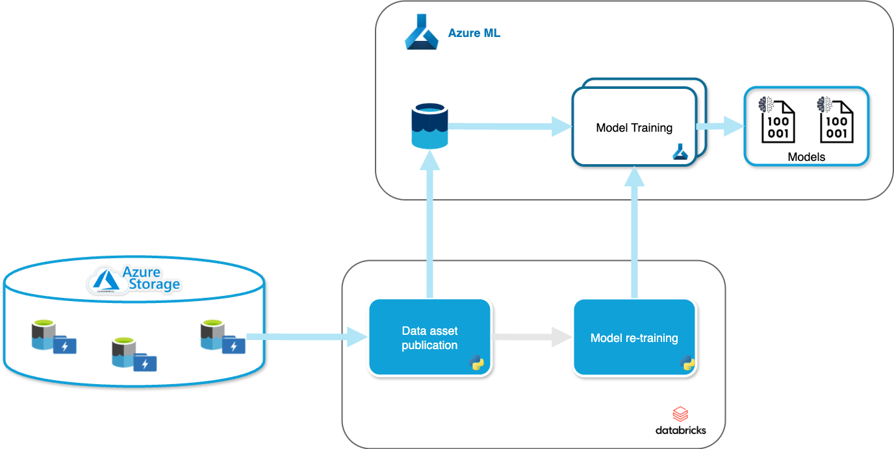

# Drift - Data Refresh and Intelligent Fast Training

[](https://www.python.org/downloads/)
[](LICENSE)

**Drift** is an automation framework for Azure Machine Learning that streamlines the process of registering training datasets and retraining models in response to data updates. Built on top of [PyDataIO](https://github.com/AmadeusITGroup/PyDataIO), Drift provides a robust solution for managing ML pipelines in Databricks and Azure ML environments.

## 📋 Table of Contents

- [Overview](#overview)
- [Design Architecture](#design-architecture)
- [Features](#features)
- [Installation](#installation)
- [Getting Started](#getting-started)
- [Usage](#usage)
  - [Training Dataset Registration](#training-dataset-registration)
  - [Model Retraining](#model-retraining)
- [Running Jobs in Databricks](#running-jobs-in-databricks)
- [Configuration](#configuration)
- [Contributing](#contributing)
- [License](#license)

## 🎯 Overview

Drift automates two critical ML operations workflows:

1. **Dataset Registration**: Automatically registers new versions of training datasets from Azure Data Lake Storage Gen2 to Azure ML as both MLTable and URI folder assets.

2. **Model Retraining**: Intelligently triggers retraining of ML models when new data becomes available, ensuring your models stay up-to-date with the latest data.

The framework is built on [PyDataIO](https://github.com/AmadeusITGroup/PyDataIO), leveraging its pipeline orchestration capabilities to create robust, configurable ML workflows.

## 🏗️ Design Architecture



The architecture consists of two main components:
- **Dataset Registrator**: Monitors data sources and registers new dataset versions
- **Model Retrainer**: Detects new dataset versions and triggers model retraining jobs

## ✨ Features

- **Automated Dataset Registration**: Register Delta Lake tables as Azure ML data assets
- **Intelligent Model Retraining**: Automatically retrain models based on data asset updates
- **Version Management**: Track dataset and model versions with timestamp-based versioning
- **Flexible Configuration**: YAML-based configuration for easy customization
- **Status Monitoring**: Built-in job status tracking and timeout management
- **Group-based Training**: Support for training multiple model groups with selective retraining
- **Azure Integration**: Seamless integration with Azure ML, Databricks, and Azure Key Vault

## 📦 Installation

### Prerequisites

- Python 3.11 or higher
- Access to Azure ML workspace
- Databricks workspace (for job execution)
- Azure Data Lake Storage Gen2

### Install from source

```bash
git clone https://github.com/yourusername/Drift.git
cd Drift
pip install -e .
```

### Install dependencies

```bash
pip install -r requirements.txt
```

Or if using `uv`:

```bash
uv sync
```

## 🚀 Getting Started

### 1. Set up Azure credentials

Drift uses Azure Service Principal for authentication. Store your credentials in Azure Key Vault:

- `ApplicationID`: Your Azure AD application ID (base64 encoded)
- `ApplicationPassword`: Your Azure AD application secret (base64 encoded)

### 2. Configure your job

Create a configuration file based on the examples in the `docs/` directory.

### 3. Run a job

```bash
spark_job --config path/to/config.conf \
          --tenant <tenant-id> \
          --vault_name <key-vault-name> \
          --data_asset_version <version> (optional)
```

## 📖 Usage

### Training Dataset Registration

The Dataset Registrator creates new versions of training data assets in Azure ML from Delta Lake tables stored in Azure Data Lake Storage Gen2.

**Configuration Example** (`example-training-dataset-registrator.conf`):

```yaml
parameters:
    azml:
        subscriptionId: <azure-ml-subscription-id>
        resourceGroup: <azure-ml-resource-group>
        mlWorkspaceName: <azure-ml-mlWorkspace-name>
    storageAccountName: <azure-storage-account-name>
    containerName: <azure-container-name>
    containerDataPath: <path-into-container>
```

**What it does:**
1. Connects to Azure Data Lake Storage Gen2
2. Creates/updates a datastore in Azure ML
3. Registers the Delta Lake table as an MLTable asset
4. Registers the data as a URI folder asset
5. Generates a timestamp-based version number
6. Publishes the new version to Databricks job task values

### Model Retraining

The Model Retrainer automatically triggers retraining jobs for models that use updated data assets.

**Configuration Example** (`example-model-retrainer.conf`):

```yaml
parameters:
    azml:
        subscriptionId: <azure-ml-subscription-id>
        resourceGroup: <azure-ml-resource-group>
        mlWorkspaceName: <azure-ml-mlWorkspace-name>
    dataAssets:
      - name: mltable_seat_spinning_features
        value: <ml-table-name>
      - name: raw_data
        value: <raw-dataset-name>
    refreshTimeout: "2700"
    refreshDelay: "10"
```

**What it does:**
1. Retrieves all Azure ML pipeline jobs matching the naming pattern
2. Identifies the most recent job for each model group
3. Creates new retraining jobs with updated data asset versions
4. Monitors job completion with configurable timeout and refresh intervals
5. Reports success or failure status

**Job Naming Convention:**
Jobs should follow the pattern: `{model_name_prefix}_{timestamp}_{random_string}`

## 🔧 Running Jobs in Databricks

Drift is designed to run as Databricks jobs. The recommended way to deploy is using Databricks Asset Bundles (DABs).

### Using Databricks Asset Bundles (Recommended)

Create a `databricks.yml` file to define your workflow. Here's a complete example:

```yaml
resources:
  jobs:
    retraining_models:
      name: retraining-models
      email_notifications:
        no_alert_for_skipped_runs: true
      schedule:
        quartz_cron_expression: 0 0 8 ? * MON *
        timezone_id: UTC
        pause_status: PAUSED
      tasks:
        - task_key: training-dataset-registrator
          python_wheel_task:
            package_name: drift
            entry_point: spark_job
            parameters:
              - --tenant
              - <tenant-id>
              - --vault_name
              - <vault-name>
              - --config
              - <path-to-configuration-file>
          job_cluster_key: retraining-models-cluster
          libraries:
            - whl: <path-to-drift-python-wheel>
        - task_key: model-retrainer
          depends_on:
            - task_key: training-dataset-registrator
          python_wheel_task:
            package_name: drift
            entry_point: spark_job
            parameters:
              - --tenant
              - <tenant-id>
              - --vault_name
              - <vault-name>
              - --data_asset_version
              - "{{tasks.`training-dataset-registrator`.values.data_asset_version}}"
              - --config
              - <path-to-configuration-file>
          job_cluster_key: retraining-models-cluster
          libraries:
            - whl: <path-to-drift-python-wheel>
      job_clusters:
        - job_cluster_key: retraining-models-cluster
          new_cluster:
            cluster_name: ""
            spark_version: 15.4.x-scala2.12
            node_type_id: Standard_D4s_v5
            enable_elastic_disk: true
            data_security_mode: DATA_SECURITY_MODE_DEDICATED
            kind: CLASSIC_PREVIEW
            is_single_node: true
      queue:
        enabled: false
```

See the complete example in [`docs/example-databricks-workflow.yaml`](docs/example-databricks-workflow.yaml).

**Deployment Steps:**

1. **Build the Drift wheel package:**
   ```bash
   uv build
   ```

2. **Upload the wheel to Databricks:**
   ```bash
   databricks fs cp dist/drift-*.whl dbfs:/path/to/drift-wheel/
   ```

3. **Deploy the workflow:**
   ```bash
   databricks bundle deploy
   ```

4. **Run the workflow:**
   ```bash
   databricks bundle run retraining_models
   ```

### Key Configuration Details

**Task 1: Dataset Registration**
- Registers new training dataset versions
- Outputs the new version via `data_asset_version` task value

**Task 2: Model Retraining**
- Depends on Task 1 completion
- Retrieves the dataset version using: `{{tasks.`training-dataset-registrator`.values.data_asset_version}}`
- Triggers retraining jobs with the new data version

**Scheduling:**
- The example runs weekly on Mondays at 8 AM UTC
- Modify the `quartz_cron_expression` to adjust the schedule
- Set `pause_status: UNPAUSED` to activate the schedule

### Prerequisites

1. **Databricks CLI installed:**
   ```bash
   pip install databricks-cli
   ```

2. **Databricks secrets configured:**
   - Set up a secret scope linked to Azure Key Vault
   - Ensure it contains `ApplicationID` and `ApplicationPassword` (base64 encoded)

3. **Configuration files uploaded:**
   - Upload your configuration files to DBFS
   - Update the `--config` parameter paths in the workflow

4. **Drift wheel package:**
   - Build and upload the Drift wheel to DBFS
   - Update the `whl` path in the libraries section

### Manual Setup (Alternative)

If you prefer to create jobs manually through the Databricks UI:

1. **Create a new job** with two tasks
2. **Task 1 Configuration:**
   - Task type: Python wheel
   - Package name: `drift`
   - Entry point: `spark_job`
   - Parameters: `--config <config-path> --tenant <tenant-id> --vault_name <vault-name>`

3. **Task 2 Configuration:**
   - Depends on: Task 1
   - Task type: Python wheel
   - Package name: `drift`
   - Entry point: `spark_job`
   - Parameters: `--config <config-path> --tenant <tenant-id> --vault_name <vault-name> --data_asset_version {{tasks.training-dataset-registrator.values.data_asset_version}}`

4. **Attach libraries:** Add the Drift wheel to both tasks

5. **Configure cluster:** Use Spark 15.4.x with appropriate node type

## ⚙️ Configuration

### Required Parameters

**For Dataset Registration:**
- `azml.subscriptionId`: Azure subscription ID
- `azml.resourceGroup`: Azure resource group name
- `azml.mlWorkspaceName`: Azure ML workspace name
- `storageAccountName`: Azure Storage account name
- `containerName`: Storage container name
- `containerDataPath`: Path within the container

**For Model Retraining:**
- `azml.subscriptionId`: Azure subscription ID
- `azml.resourceGroup`: Azure resource group name
- `azml.mlWorkspaceName`: Azure ML workspace name
- `dataAssets`: List of data assets to monitor (name and value)
- `refreshTimeout`: Maximum time to wait for job completion (seconds)
- `refreshDelay`: Interval between status checks (seconds)

### Optional Parameters

- `data_asset_version`: Specific version to use for retraining (if not provided, uses latest)
- `model_name_prefix`: Comma-separated list of model prefix to retrain (if not provided, retrains all matching training jobs)

## 🤝 Contributing

We welcome contributions! Please see our [Contributing Guide](CONTRIBUTING.md) for details on:

- How to report issues
- Development setup and workflow
- Code quality standards and testing
- Pull request process

Please also read our [Code of Conduct](CODE_OF_CONDUCT.md) before contributing.

## 📄 License

This project is licensed under the Apache License 2.0 - see the [LICENSE](LICENSE) file for details.

## 🙏 Acknowledgments

- Built on top of [PyDataIO](https://github.com/AmadeusITGroup/PyDataIO)
- Developed by Simone DE SANTIS and Guillaume LECLERC at Amadeus

## 📞 Support

For issues and questions:
- Open an issue on GitHub
- Check existing documentation in the `docs/` directory

---

**Note**: This project is designed for Azure ML and Databricks environments. Ensure you have the necessary permissions and resources configured before running jobs.
